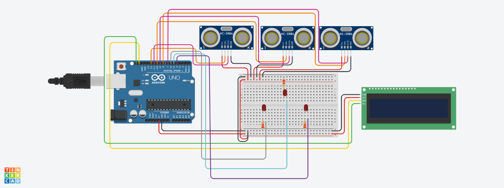

<h1 align='center'>
    Sistema de Detecção de Obstáculos com Arduino
</h1>

<h3>
    Este é um projeto de sistema de detecção de obstáculos utilizando Arduino e sensores ultrassônicos, desenvolvido com um pensamento voltado a segurança dos pilotos da Fórmula E.
</h3>

  <a href="#participantes">Participantes</a> |
  <a href="#objetivos">Objetivos</a> |
  <a href="#hardware-utilizado">Hardware Utilizado</a> |
  <a href="#funcionamento-do-código">Funcionamento do Código</a> |
  <a href="#instalação-e-utilização">Instalação e Utilização</a> |
  <a href="#aviso">Aviso</a> 

## Participantes
1ESPI - Engenharia de Software
* João Henrique Sena Hoffmann (RM550763)
* Lucas Ludovico Cabral (RM554589)
* Vinicius Fernandes Tavares Bittencourt (RM558909)
* Weslley Oliveira Cardoso (RM557927)

## Objetivos
O objetivo deste projeto é poder auxiliar o piloto no seu senso de espaço, para proteger tanto ele mesmo quanto quem dirige ao seu lado, o projeto foi pensado para pilotos de corrida, mas é possível ser utilizado por cidadãos comuns. O sistema utiliza sensores de distância ultrassônicos para detectar a presença de obstáculos em três direções: esquerda, frente e direita. De forma que, é possível ter uma segurança maior durante a corrida, ou seu trajeto com o carro.

## Hardware Utilizado
* Arduino Uno
* Sensores de Distância (HC-SR04)
* LEDs Vermelhos
* Resistores
* Display LCD I2C (16x2)

## Funcionamento do Código
O sistema faz a definição dos pinos tanto de LED, como os dos sensores de distância. Com esses valores dos sensores (esquerda, frente, direita), ele fará uma verificação para saber se a distância é menor do que um valor prescrito anteriormente. Caso o valor seja menor, indica que o obstáculo está próximo, assim é apresentada uma notificação no display sobre este obstáculo, e também o LED correspondente é aceso. Mas caso, a condição não seja válida, os LED se apagarão e o display mostrará apenas o carro.

## Instruções de Uso
* Conecte os componentes conforme o esquema de ligação.
* Carregue o código para a placa Arduino.
* Posicione os sensores de distância em locais adequados para detecção de obstáculos.
* Ligue a alimentação da placa Arduino.
* Observe o display LCD e os LEDs para determinar a presença de obstáculos em cada direção.

## Aviso
Este projeto é uma prova de conceito e deve ser adaptado e aprimorado conforme as necessidades específicas da aplicação.