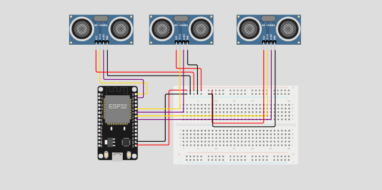

<h1 align='center'>
    Sistema de Detecção de Obstáculos com IoT
</h1>

<h3>
    Este projeto visa desenvolver um sistema de detecção de obstáculos utilizando dispositivos IoT, proporcionando segurança em ambientes como corridas e trajetos urbanos.
</h3>

  <a href="#participantes">Participantes</a> |
  <a href="#objetivos">Objetivos</a> |
  <a href="#hardware-utilizado">Hardware Utilizado</a> |
  <a href="#funcionamento-do-código">Funcionamento do Código</a> |
  <a href="#arquitetura-da-solução">Arquitetura da Solução</a> |
  <a href="#instruções-de-uso">Instruções de Uso</a> |
  <a href="#avisos">Avisos</a>

## Participantes
* João Henrique Sena Hoffmann (RM550763)
* Lucas Ludovico Cabral (RM554589)
* Rafael Teofilo Lucena (RM555600)
* Vinicius Fernandes Tavares Bittencourt (RM558909)
* Weslley Oliveira Cardoso (RM557927)

## Objetivos
O objetivo deste projeto é aumentar a segurança dos motoristas, proporcionando uma detecção precisa de obstáculos em três direções (esquerda, frente e direita) através de sensores ultrassônicos. O sistema pode ser utilizado em contextos de corridas e em trajetos urbanos comuns.

## Hardware Utilizado
* ESP32
* Sensores de Distância (HC-SR04)
* Jumpers

## Funcionamento do Código
O código está dividido entre a configuração do ESP32 e a aplicação web em Dash. O ESP32 conecta-se a uma rede Wi-Fi e ao broker MQTT, publicando as distâncias medidas e a presença de obstáculos.

A aplicação Dash consome os dados dos obstáculos através de uma API, converte os timestamps para o horário de São Paulo, e exibe as informações em um gráfico em tempo real.

### Código do ESP32
O código do ESP32 configura os sensores de distância, medindo a distância até os obstáculos e publicando os dados nos tópicos MQTT apropriados. Mudando os valores enviados dependendo a partir da leitura dos sensores.

### Código em Python
A aplicação Dash recebe os dados do broker MQTT, processa as informações e as exibe em um gráfico de linhas com os três sensores em tempo real.

## Arquitetura da Solução
O diagrama de arquitetura representa os dispositivos IoT, a comunicação via MQTT e a aplicação web que processa e exibe os dados. A aplicação mobile é para a continuação do projeto, com envio de notificações via aplicativo.

## Instruções de Uso
1. **Configurar Hardware**:
    * Conecte os três sensores de distância ao ESP32.
    * Certifique-se de que o broker MQTT esteja configurado e acessível.

2. **Carregar Código no ESP32**:
    * Carregue o código no dispositivo ESP32.

3. **Configurar Máquina Virtual**
    * Criar máquina virtual (em cloud service, de preferência).
    * Instalar dependências necessárias:
      * Docker;
      * Fiware;
      * Bibliotecas Python.
  
4. **Iniciar Aplicação Dash**:
    * Execute o script Python que contém a aplicação Dash.
    * Acesse a interface web no navegador.

5. **Monitorar**:
    * Observe o gráfico para identificar a presença de obstáculos.

## Avisos
Este projeto é uma prova de conceito e deve ser adaptado e aprimorado conforme as necessidades específicas da aplicação.